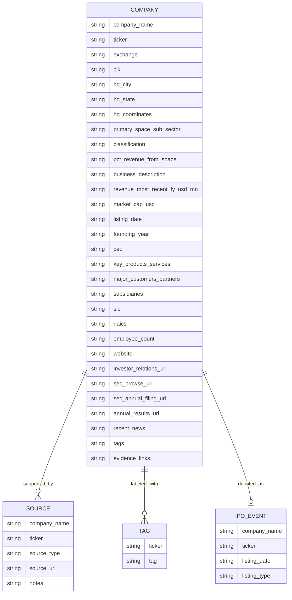
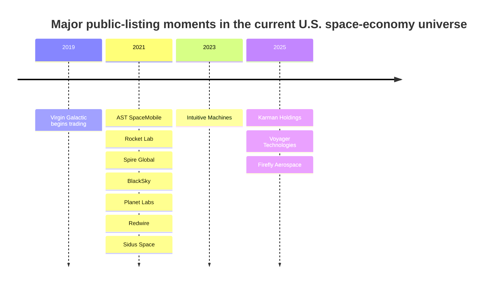

# U.S. Public Space Economy Companies Dataset

## Executive summary

Using current public-company status as of **May 14, 2026**, this research compiles a **best-effort universe of 24 U.S.-headquartered, currently public companies** whose businesses are principally in space or that report material, named space activity as a core part of their business. The resulting dataset spans launch, spacecraft and lunar infrastructure, Earth observation and geospatial analytics, satellite communications, space-enabled data, ground segment and network infrastructure, defense-related space primes, and space supply-chain manufacturers. The public universe recently expanded through the public debuts of **Karman**, **Voyager Technologies**, and **Firefly Aerospace**, while it may contract again if **Amazon’s April 14, 2026 agreement to acquire Globalstar** closes. citeturn31search3turn15news41turn6search15turn19news41

The dataset is analytically useful because the public space economy is **bifurcated**. By count, the set is tilted toward newer pure-play names. By scale, it is dominated by diversified primes and large satcom operators. In the current-market-cap snapshots used for this file, **Boeing, Lockheed Martin, Northrop Grumman, and L3Harris** are vastly larger than smaller pure-plays such as **Sidus Space** and **Momentus**. citeturn9finance6turn9finance7turn9finance8turn9finance9turn8finance7turn9finance4

Revenue scale also varies enormously. At the smaller end, **Sidus Space** reported about **$3.4 million** of FY2025 revenue. Mid-scale pure-plays include **Rocket Lab** at **$602.0 million**, **Intuitive Machines** at **$210.1 million**, and **Iridium** at **$871.7 million**. At the diversified end, **EchoStar**, **Lockheed Martin**, and **Boeing** reported about **$15.0 billion**, **$75.0 billion**, and **$89.5 billion** of most-recent annual revenue, respectively. Karman is especially useful for mixed-space analysis because it explicitly disclosed **$149.8 million** of FY2025 revenue from its **Space and Launch** end market, or roughly **31.8%** of total FY2025 revenue. citeturn24view0turn11search0turn25view0turn13search14turn18search8turn17search2turn17search0turn23view0

The deliverables below include a **CSV-ready master table**, a **separate sources table**, **download links** for the generated CSV files, a **field/schema design** for apps, and visualization guidance. The file is built to be practical for mapping, faceting, tagging, and relationship/network visualization while preserving evidence URLs for each company.

## Methodology

The inclusion screen was intentionally conservative. I included companies that are **currently public** and **U.S.-headquartered**, then kept only those whose business is either clearly space-first or that disclose an important, named space business line, sector, or end market. That means the file includes pure-play companies such as Rocket Lab, AST SpaceMobile, Intuitive Machines, Planet, BlackSky, Spire, Sidus, Virgin Galactic, Iridium, Globalstar, Momentus, and Firefly, but it also includes diversified names such as Karman, Voyager, Kratos, L3Harris, Lockheed Martin, Northrop Grumman, Boeing, Moog, Viasat, EchoStar, and Comtech because each has material and explicitly marketed space activity. Representative primary-source examples include **SEC cover-page/XBRL data** for Redwire, **SEC filing-index metadata** for Planet, BlackSky, Virgin Galactic, and Viasat, and official **annual-results pages** for Intuitive Machines, Sidus, Karman, Iridium, EchoStar, Lockheed Martin, and Boeing. citeturn32view0turn35search0turn35search5turn35search10turn35search11turn25view0turn24view0turn23view0turn13search14turn18search8turn17search2turn17search0

Search strategy followed a layered process. First, I assembled a candidate list from current public space names, recent IPOs, and known defense-space primes. Second, I verified public status, exchange, CIK, and headquarters using **SEC EDGAR** and official IR pages. Third, I populated revenue and narrative fields from official annual-results releases, annual reports, and IR pages. Fourth, I attached recent evidence links from official company releases and reputable press when those events materially changed investability or universe membership, such as Rocket Lab’s Mynaric acquisition and Amazon’s agreement to buy Globalstar. citeturn26search4turn19news41

The dataset prioritizes **primary sources**. For each company, the downloadable CSV includes at least an **investor relations URL**, a **SEC browse URL**, and an **annual filing / annual-results evidence URL**. Auxiliary enrichments were handled transparently. **Market cap** is a current snapshot as of May 14, 2026. **Shares outstanding** is generally an estimate derived from current market cap and share price unless a cover-page value was directly visible in SEC materials. **Headquarters coordinates** are approximate **city-centroid** values chosen for mapping, not parcel-level geocodes. **Logo URLs** are convenience enrichments for app prototyping and should be revalidated in production.

### Open questions and limitations

Some fields remain **`unspecified`** where precise, current, primary-source values were not quickly recoverable without sacrificing rigor. This affects, most notably, some legacy **listing dates**, some **employee counts**, many **NAICS codes**, and some **public-float** values. A small number of values are explicitly marked as **derived** rather than directly disclosed. The most important example is **Firefly FY2025 revenue**, which is flagged as derived from its official year-over-year growth disclosure because the search snippet exposed the growth rate but not the exact absolute amount. The file is therefore strong for **screening, visualization, and navigation**, but any field marked derived or unspecified should be refreshed programmatically before automated trading or legal-grade use.

## Dataset structure and market map

The dataset is designed around a central **company** entity with linked evidence, taxonomy, and news fields. That structure is intended to work well in a BI tool, graph database, map, or front-end filter UI.



The IPO/public-listing timeline is one of the clearest ways to show how the listed U.S. space universe evolved from a trickle into a 2021 SPAC/IPO wave and then a renewed 2025-2026 listing cycle.



That recent IPO resurgence is well documented by official and reputable-market coverage for **Karman**, **Voyager**, and **Firefly**. citeturn31search3turn15news41turn6search15

## Master CSV table

The downloadable master file contains the full field set, including evidence URLs, tags, source bundles, coordinate basis, and enrichment notes.

[Download the master CSV](sandbox:/mnt/data/us_public_space_companies_master_2026-05-14.csv)  
[Download the sources CSV](sandbox:/mnt/data/us_public_space_companies_sources_2026-05-14.csv)  
[Download the JSON schema](sandbox:/mnt/data/us_public_space_companies_schema_2026-05-14.json)

The markdown table below is a **condensed view** for readability. The CSV contains the full, wider schema.

| Company | Ticker | HQ | Primary sub-sector | FY revenue USDm | Market cap USDbn | Class |
|---|---:|---|---|---:|---:|---|
| Rocket Lab USA, Inc. | RKLB | Long Beach, CA | Launch / spacecraft manufacturing | 602.0 | 80.25 | pure-play |
| Redwire Corporation | RDW | Jacksonville, FL | Space infrastructure / manufacturing | 335.4 | 2.71 | pure-play |
| AST SpaceMobile, Inc. | ASTS | Midland, TX | Direct-to-device satcom | 70.9 | 24.13 | pure-play |
| Intuitive Machines, Inc. | LUNR | Houston, TX | Lunar infrastructure / services | 210.1 | 4.30 | pure-play |
| Planet Labs PBC | PL | San Francisco, CA | Earth observation data / analytics | 307.7 | 13.31 | pure-play |
| BlackSky Technology Inc. | BKSY | Herndon, VA | Geospatial intelligence / EO | 106.6 | 1.58 | pure-play |
| Spire Global, Inc. | SPIR | Vienna, VA | Space-enabled data / analytics | 71.6 | 0.59 | pure-play |
| Sidus Space, Inc. | SIDU | Cape Canaveral, FL | Satellite manufacturing / mission data | 3.4 | 0.09 | pure-play |
| Virgin Galactic Holdings, Inc. | SPCE | Tustin, CA | Space tourism / research flights | unspecified | 0.17 | pure-play |
| Viasat, Inc. | VSAT | Carlsbad, CA | Satcom / ground infrastructure | 4500.0 | 10.47 | diversified |
| Iridium Communications Inc. | IRDM | McLean, VA | Mobile satcom | 871.7 | 4.63 | pure-play |
| Globalstar, Inc. | GSAT | Covington, LA | Mobile satcom / D2D | 273.0 | 10.54 | pure-play |
| EchoStar Corporation | SATS | Englewood, CO | Satellite / broadband / communications | 15000.0 | 39.05 | diversified |
| Comtech Telecommunications Corp. | CMTL | Chandler, AZ | Ground segment / satcom infrastructure | unspecified | 0.12 | diversified |
| Momentus Inc. | MNTS | San Jose, CA | In-space transportation / orbital infrastructure | 54.3 | 0.02 | pure-play |
| Karman Holdings Inc. | KRMN | Huntington Beach, CA | Space / launch supply chain | 471.5 | 8.74 | diversified |
| Firefly Aerospace Inc. | FLY | Leander, TX | Launch / lunar / orbital vehicles | 159.9 derived | 6.77 | pure-play |
| Voyager Technologies, Inc. | VOYG | Denver, CO | Space infrastructure / defense technology | 166.4 | 2.11 | diversified |
| Kratos Defense & Security Solutions, Inc. | KTOS | San Diego, CA | Defense-related space systems | unspecified | 9.84 | diversified |
| L3Harris Technologies, Inc. | LHX | Melbourne, FL | Defense-related space contractor | unspecified | 57.31 | diversified |
| Lockheed Martin Corporation | LMT | Bethesda, MD | Prime space contractor | 75000.0 | 119.99 | diversified |
| Northrop Grumman Corporation | NOC | Falls Church, VA | Prime space contractor | unspecified | 78.18 | diversified |
| The Boeing Company | BA | Arlington, VA | Defense / space / security prime | 89463.0 | 180.69 | diversified |
| Moog Inc. | MOG.A | East Aurora, NY | Space and defense components | unspecified | 10.03 | diversified |

Current market-cap snapshots in the file reflect May 14, 2026 pricing. Representative finance snapshots for included companies confirm the large spread between the biggest diversified primes and the smallest listed pure-plays. citeturn9finance6turn9finance7turn9finance8turn9finance9turn8finance7turn9finance4

## Sources table

The full one-row-per-source table is in the downloadable **sources CSV**. The condensed table below gives each company a quick evidence bundle.

| Company | IR | SEC / filing trail | Current evidence |
|---|---|---|---|
| Rocket Lab | [IR](https://investors.rocketlabcorp.com/investor-relations) | [SEC](https://www.sec.gov/edgar/browse/?CIK=1819994&owner=exclude&action=getcompany) | [Mynaric acquisition](https://investors.rocketlabcorp.com/news-releases/news-release-details/rocket-lab-completes-mynaric-acquisition-adding-laser-optical) |
| Redwire | [IR](https://ir.redwirespace.com/) | [SEC](https://www.sec.gov/edgar/browse/?CIK=1819810&owner=exclude&action=getcompany) | [FY2025 results](https://ir.redwirespace.com/news-events/press-releases/detail/217/redwire-corporation-reports-fourth-quarter-and-full-year) |
| AST SpaceMobile | [IR](https://investors.ast-science.com/) | [SEC](https://www.sec.gov/edgar/browse/?CIK=1780312&owner=exclude&action=getcompany) | [Quarterly results hub](https://investors.ast-science.com/quarterly-results) |
| Intuitive Machines | [IR](https://investors.intuitivemachines.com/) | [SEC](https://www.sec.gov/edgar/browse/?CIK=1844452&owner=exclude&action=getcompany) | [FY2025 results](https://investors.intuitivemachines.com/news-releases/news-release-details/intuitive-machines-reports-fourth-quarter-and-full-year-2025) |
| Planet | [IR](https://investors.planet.com/overview/default.aspx) | [SEC](https://www.sec.gov/edgar/browse/?CIK=1836833&owner=exclude&action=getcompany) | [Quarterly results hub](https://investors.planet.com/financials/quarterly-results/default.aspx) |
| BlackSky | [IR](https://ir.blacksky.com/overview/default.aspx) | [SEC](https://www.sec.gov/edgar/browse/?CIK=1753539&owner=exclude&action=getcompany) | [Q1 2026 results](https://ir.blacksky.com/news-events/press-releases/news-details/2026/BlackSky-Reports-First-Quarter-2026-Results/default.aspx) |
| Spire | [IR](https://ir.spire.com/) | [SEC](https://www.sec.gov/edgar/browse/?CIK=1816017&owner=exclude&action=getcompany) | [Q1 2026 results](https://ir.spire.com/news-events/press-releases/detail/298/spire-global-announces-first-quarter-2026-results) |
| Sidus | [IR](https://investors.sidusspace.com/) | [SEC](https://www.sec.gov/edgar/browse/?CIK=1651562&owner=exclude&action=getcompany) | [FY2025 results](https://investors.sidusspace.com/news-events/press-releases/detail/278/sidus-space-reports-full-year-2025-financial-results-and) |
| Virgin Galactic | [IR](https://investors.virgingalactic.com/overview/default.aspx) | [SEC](https://www.sec.gov/edgar/browse/?CIK=1706946&owner=exclude&action=getcompany) | [Q1 2026 update](https://www.virgingalactic.com/news/virgin-galactic-announces-first-quarter-2026-financial-results-and-provides-business-update) |
| Viasat | [IR](https://investors.viasat.com/) | [SEC](https://www.sec.gov/edgar/browse/?CIK=797721&owner=exclude&action=getcompany) | [Board / strategic-review update](https://investors.viasat.com/news-releases/news-release-details/viasat-announces-appointment-shekar-ayyar-and-jinhy-yoon-board) |
| Iridium | [IR](https://www.iridium.com/company/investor-relations/) | [SEC](https://www.sec.gov/edgar/browse/?CIK=1418819&owner=exclude&action=getcompany) | [Syniverse NTN Direct partnership](https://investor.iridium.com/2025-05-29-Iridium-and-Syniverse-Partner-to-Bring-Direct-to-Device-Satellite-Connectivity-to-Mobile-Network-Operators-Worldwide) |
| Globalstar | [IR](https://investors.globalstar.com/) | [SEC](https://www.sec.gov/edgar/browse/?CIK=1366868&owner=exclude&action=getcompany) | [Amazon acquisition agreement](https://www.reuters.com/business/media-telecom/amazon-signs-1157-billion-deal-satellite-firm-globalstar-challenge-starlink-2026-04-14/) |
| EchoStar | [IR](https://ir.echostar.com/) | [SEC](https://www.sec.gov/edgar/browse/?CIK=1415404&owner=exclude&action=getcompany) | [FY2025 results](https://ir.echostar.com/news-releases/news-release-details/echostar-announces-financial-results-three-and-twelve-months-6) |
| Comtech | [IR](https://comtech.com/investors/) | [SEC](https://www.sec.gov/edgar/browse/?CIK=850730&owner=exclude&action=getcompany) | [FY2025 results](https://comtech.com/press-releases/2025/11/10/comtech-announces-financial-results-for-fourth-quarter-and-fiscal-year-2025/) |
| Momentus | [IR](https://investors.momentus.space/) | [SEC](https://www.sec.gov/edgar/browse/?CIK=1781162&owner=exclude&action=getcompany) | [Annual reports hub](https://investors.momentus.space/financial-information/annual-reports/) |
| Karman | [IR](https://investors.karman-sd.com/overview/default.aspx) | [SEC](https://www.sec.gov/edgar/browse/?CIK=2040127&owner=exclude&action=getcompany) | [FY2025 results](https://investors.karman-sd.com/News--Events/press-releases/news-details/2026/Karman-Space--Defense-Reports-Fourth-Quarter-and-Full-Fiscal-Year-2025-Financial-Results/default.aspx) |
| Firefly | [IR](https://investors.fireflyspace.com/investor-relations) | [SEC](https://www.sec.gov/edgar/browse/?CIK=1860160&owner=exclude&action=getcompany) | [FY2025 results](https://investors.fireflyspace.com/news-releases/news-release-details/firefly-aerospace-announces-fourth-quarter-and-full-year-2025) |
| Voyager | [IR](https://investors.voyagertechnologies.com/overview/default.aspx) | [SEC](https://www.sec.gov/edgar/browse/?CIK=1788060&owner=exclude&action=getcompany) | [FY2025 results](https://voyagertechnologies.com/press-releases/voyager-reports-fourth-quarter-and-full-year-2025-financial-results-enters-2026-with-record-backlog-increases-2026-revenue-guidance/) |
| Kratos | [IR](https://ir.kratosdefense.com/) | [SEC](https://www.sec.gov/edgar/browse/?CIK=1069258&owner=exclude&action=getcompany) | [FY2025 results](https://www.kratosdefense.com/newsroom/kratos-reports-fourth-quarter-and-full-year-2025-financial-results) |
| L3Harris | [IR](https://investors.l3harris.com/) | [SEC](https://www.sec.gov/edgar/browse/?CIK=202058&owner=exclude&action=getcompany) | [FY2025 results](https://investors.l3harris.com/news/news-details/2026/L3Harris-Technologies-Reports-Strong-Full-Year-and-Fourth-Quarter-2025-Results-Initiates-2026-Guidance/default.aspx) |
| Lockheed Martin | [IR](https://investors.lockheedmartin.com/) | [SEC](https://www.sec.gov/edgar/browse/?CIK=936468&owner=exclude&action=getcompany) | [FY2025 results](https://investors.lockheedmartin.com/news-releases/news-release-details/lockheed-martin-reports-fourth-quarter-and-full-year-2025) |
| Northrop Grumman | [IR](https://investor.northropgrumman.com/) | [SEC](https://www.sec.gov/edgar/browse/?CIK=1133421&owner=exclude&action=getcompany) | [FY2025 results](https://investor.northropgrumman.com/news-releases/news-release-details/northrop-grumman-releases-fourth-quarter-and-full-year-2025) |
| Boeing | [IR](https://investors.boeing.com/investors/overview/default.aspx) | [SEC](https://www.sec.gov/edgar/browse/?CIK=12927&owner=exclude&action=getcompany) | [FY2025 results](https://investors.boeing.com/investors/news/press-release-details/2026/Boeing-Reports-Fourth-Quarter-Results/default.aspx) |
| Moog | [IR](https://www.moog.com/investors.html) | [SEC](https://www.sec.gov/edgar/browse/?CIK=67887&owner=exclude&action=getcompany) | [Financials hub](https://www.moog.com/investors/financials.html) |

## Visualization ideas and JSON schema

For visualization, the most useful first pass is a **three-layer dashboard**. Start with a **bubble chart** using **market cap on one axis and most-recent FY revenue on the other**, colored by **primary space sub-sector** and sized by **estimated shares outstanding**. Add a **U.S. map** using the headquarters coordinate field, but treat those dots as city-level rather than exact-building locations. Then add a **pure-play versus diversified** comparator with either a stacked bar or slope graph. Karman is a particularly good candidate for a mixed-exposure visual because it explicitly reports a discrete **Space and Launch** end market. citeturn23view0

A second layer should focus on relationships. The dataset is structured so you can build a **network graph** from `major_customers_partners`, `subsidiaries`, and `tags`. That makes it possible to show clusters such as **lunar infrastructure** around Intuitive and Firefly, **EO/data** around Planet, BlackSky, and Spire, **mobile satcom** around Iridium and Globalstar, and **defense-prime space** around Lockheed, Northrop, Boeing, and L3Harris. Recent strategic events make this especially interesting today: Rocket Lab is moving deeper into optical communications through Mynaric, and Globalstar is now subject to a pending takeout by Amazon. citeturn26search4turn19news41

Other high-value charts include:
- a **timeline** of public listings and major corporate actions;
- a **treemap** by taxonomy and classification;
- a **heatmap** of tags by company;
- a **scatter** of revenue versus market cap with pure-play/diversified filtering;
- a **Sankey** from company to customer/partner categories;
- a **small-multiples map** by tag cluster.

A practical JSON schema for app ingestion looks like this. The downloadable schema file contains the complete version.

```json
{
  "$schema": "https://json-schema.org/draft/2020-12/schema",
  "title": "US Public Space Economy Companies Dataset",
  "type": "object",
  "required": [
    "company_name",
    "ticker",
    "exchange",
    "cik",
    "hq_city",
    "hq_state",
    "primary_space_sub_sector",
    "business_description",
    "revenue_most_recent_fy_usd_mn",
    "market_cap_usd",
    "website",
    "investor_relations_url",
    "sec_browse_url",
    "evidence_links"
  ],
  "properties": {
    "company_name": { "type": "string" },
    "ticker": { "type": "string" },
    "exchange": { "type": "string" },
    "cik": { "type": "string" },
    "hq_city": { "type": "string" },
    "hq_state": { "type": "string" },
    "hq_coordinates": { "type": "string" },
    "primary_space_sub_sector": { "type": "string" },
    "classification": { "type": "string" },
    "pct_revenue_from_space": { "type": "string" },
    "business_description": { "type": "string" },
    "revenue_most_recent_fy_usd_mn": { "type": "string" },
    "market_cap_usd": { "type": "string" },
    "public_float_usd_mn": { "type": "string" },
    "shares_outstanding_current_est": { "type": "string" },
    "listing_date": { "type": "string" },
    "founding_year": { "type": "string" },
    "ceo": { "type": "string" },
    "key_products_services": { "type": "string" },
    "major_customers_partners": { "type": "string" },
    "subsidiaries": { "type": "string" },
    "sic": { "type": "string" },
    "naics": { "type": "string" },
    "employee_count": { "type": "string" },
    "website": { "type": "string" },
    "investor_relations_url": { "type": "string" },
    "sec_browse_url": { "type": "string" },
    "sec_annual_filing_url": { "type": "string" },
    "annual_results_url": { "type": "string" },
    "recent_news": { "type": "string" },
    "tags": { "type": "string" },
    "logo_url": { "type": "string" },
    "headquarters_coordinates_precision": { "type": "string" },
    "ceo_source_url": { "type": "string" },
    "evidence_links": { "type": "string" },
    "as_of_date": { "type": "string" },
    "market_cap_basis": { "type": "string" },
    "shares_outstanding_basis": { "type": "string" },
    "hq_coordinate_basis": { "type": "string" },
    "logo_url_basis": { "type": "string" }
  }
}
```